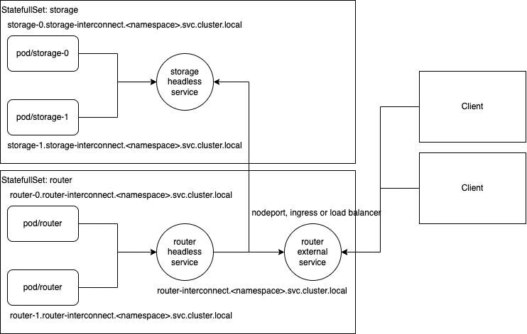

# Установка Picodata с помощью Helm

- [Установка кластера с конфигурацией по умолчанию](#Установка-кластера-с-конфигурацией-по-умолчанию)
- [Аргументы командной строки helm](#Аргументы-командной-строки-helm)
  — [Концепции](#Концепции)
  — [Полезные опции](#Полезные-опции)
- [Переопределение параметров и запуск своего кластера](#Переопределение-параметров-и-запуск-своего-кластера)

Одним из самых распространенных способов управлять установкой приложений в 
`kubernetes` является пакетный менеджер `helm`. Он позволяет шаблонизировать
манифесты, динамичестки конфигурировать приложение, разделять релизы и
управлять порядком установки в кластер.
Чарт `picodata` позволяет установить `picodata` в кластер `kubernetes` 
одной командой, а также гибко конфигурировать кластер с помощью 
переопределения `chart values` в едином файле.

---

### Установка кластера с конфигурацией по умолчанию

Чтобы протестировать `picodata`, первым делом нужно поднять кластер `kubernetes` 
или `minikube`, а затем установить чарт. Для начала клонируем репозиторий:
```shell
git clone https://git.picodata.io/picodata/picodata/picodata.git
```

Переходим в директорию с чартом:
```shell
cd picodata/helm
```

Наиболее простой вариант установки — это установка с параметрами по умолчанию. 
Выполняем вызов `helm` без параметров.
```shell
helm install my-test-release ./picodata
```

В результате мы получим примерно такую топологию:



- StatefulSet с 2 storage-подами.
- Headless-сервис для доступа к storage-подам.
- StatefulSet с 2 router-подами.
- Headless-сервис для доступа к router-подам.
- ClusterIp-сервис для доступа извне.
- HorizontalPodAutoscaler (если указан)
- Ingress (если указан)
- ServiceAccount

Так как мы ничего не меняли в `values` чарта, то установленный нами
релиз `my-test-cluster` имеет тип сервиса `ClusterIP` и по умолчанию
доступен только изнутри кластера `kubernetes`. Поэтому для проверки
состояния `picodata` необходимо запустить еще один под в том же
неймспейсе (по умолчанию используется неймспейс default):
```shell
kubectl run -it --image=docker.binary.picodata.io/picodata-diag:latest picodata-diag
```

Как только контейнер запустится и мы окажемся в его консоли, необходимо 
осуществить подключение к кластеру `picodata`.
```shell
tarantoolctl connect my-test-release-picodata-ext.default.svc.cluster.local:3031
```

После подключения можно посмотреть состояние всей Raft-группы:
```shell
box.space.raft_group:fselect()
```

---

### Аргументы командной строки helm

---

#### Концепции

- **Чарт** — набор шаблонов манифестов и шаблонов "хэлперов" для упрощенного
конфигурирования устанавливаемого в `kubernetes` приложения. `Helm chart` — это
условный аналог пакета `rpm` или `deb`, но только для `kubernetes`.
- **Релиз** — это сочетание чарта и имени релиза, переданного `helm` в командной 
строке. Откат, а также возможность установить несколько экзмепляров 
кластера работают только в рамках релиза.
- **Ревизия** — внутренняя версия установки релиза. Если мы установили
чарт с именем релиза `my-test-release` только один раз, то ревизия
релиза будет только одна. Если мы после этого еще дважды установим чарт
с тем же самым именем релиза, то ревизий будет уже 3. Допускается
переключение только на более раннюю ревизию. Все ревизии хранятся в виде
секретов в кластере `kubernetes`.
- **Values** — файл параметров. По умолчанию в каждом чарте уже есть `values`
со значениями по умолчанию, но концепция `helm` заключается в возможности 
переопределять только необходимые значения, оставляя остальные дефолтными.

---

#### Полезные опции

Для примера основных опция `helm` можно рассмотреть команду:
```shell
helm upgrade my-release-name picodata \
  --install \
  --namespace my-namespace \
  --create-namespace
  --values my-values.yml \
  --version 0.0.1 \
  --devel \
  --debug \
  --wait \
  --atomic
```
Пояснение:
- `helm upgrade` — обновить уже установленный релиз.
- `my-release-name` — название релиза, в рамках которого будут сохраняться
    ревизии.
- `picodata` — название чарта, который мы устанавливаем (может быть путем в
  файловой системе, или путем в репозитории).
- `--install` — установить чарт если еще не установлен.
- `--namespace my-namespace` — установить релиз в неймспейс my-namespace.
- `--create-namespace` — создать неймспейс, указанный в опции `--namespace`, 
если он еще не создан.
- `--values my-values.yml` — пусть к values, которые перезапишут дефолтные.
- `--version 0.0.1` — версия устанавливаемого чарта (версия приложения 
захардкожена в конкретной версии чарта).
- `--devel` — позволяет устанавливать develop-версии чартов, например 0
.0.1-alpha, или 22.10-beta-test.
- `--debug` — вывести подробную информацию об установке и отрендеренные 
манифесты.
- `--wait` — дождаться пока все поды будут запланированы планировщиком и 
перейдут в статус Running.
- `--atomic` — атомарная установка. Если установка новой ревизий прошла
неуспешно (поды не перешли в состояние Running), то откатить на
предыдущую версию и удалить текущий релиз.

---

### Переопределение параметров и запуск своего кластера

Чтобы получить копию `values` для переопределения конфигурации по умолчанию, 
нужно воспользоваться командой:
```shell
helm show values >> my-new-values.yml
```

В полученном файле `my-release-values.yml` есть следующие параметры, которые 
можно переопределить.

- Параметры образа, а также репозиторий, откуда будет получен образ `picodata`
```yaml
image:
  repository: docker.binary.picodata.io
  pullPolicy: Always
  # Если убрать тег в values, то будет использован тег, указанный в chartVersion,
  # или переданный в опции --version
  tag: 'picodata:alpha'

# Если кластер kubernetes находится в закрытом контуре и используется 
# приватный репозиторий, то необходимо заранее создать imagePullSecrets
imagePullSecrets: []
```

- Параметры `service account`
```yaml
serviceAccount:
  # Обозначает, должен ли быть создан service account
  create: true
  # Дополнительные аннотации
  annotations: {}
  # Имя service account, который будет использован текущим релизом.
  # Если не задавать имя, то оно будет сгенерировано автоматически.
  name: ''
```

- Параметры перезаписи имени.
```yaml
nameOverride: ''
fullnameOverride: ''
```

- Параметры `router stateful set`. Вся возможная конфигурация роутера задается 
только в блоке `router`.
```yaml
router:
  # Роль vshard (на текущем релизе picodata вне зависимости от того какую 
  # роль мы укажем будет все равно common)
  role: router

  # Название группы (на текущий момент не работает)
  group: router

  # Количество подов (инстансов) router
  replicaCount: 2
  
  # Фактор репликации к котому будет стремиться кластер.
  replicationFactor: 2
  
  nameOverride: ''
  fullnameOverride: ''

  podAnnotations: {}

  securityContext:
    # fsGroup: 1000
    # capabilities:
    #   drop:
    #   — ALL
    readOnlyRootFilesystem: true
    runAsNonRoot: true
    runAsUser: 1000
    runAsGroup: 1000

  # Настройки, которые будут переданы в оба сервиса router.
  # В сервисе router-interconnect будет использован только массив портов.
  # В сервисе ext будут использованы все параметры, указанные в этом блоке.
  service:
    type: ClusterIP
    ports:
      — name: binary
        protocol: TCP
        port: 3301
        targetPort: 3301
      — name: http
        protocol: TCP
        port: 8081
        targetPort: 8081

  # Параметры ingress, если в кластере kubernetes установлен какой-либо 
  # ingress controller.
  ingress:
    enabled: false
    className: ''
    annotations:
      {}
      # kubernetes.io/ingress.class: nginx
      # kubernetes.io/tls-acme: "true"
    hosts:
      — host: picodata.picodata.local
        paths:
          — path: /
            pathType: ImplementationSpecific
    tls: []
    #  — secretName: chart-example-tls
    #    hosts:
    #      — chart-example.local
  
  # В текущий момент liveness и readiness probe не реализованы в Picodata
  livenessProbe:
    {}
    # httpGet:
    #   path: /health
    #   port: http
  readinessProbe:
    {}
    # httpGet:
    #   path: /health
    #   port: http

  resources:
    {}
    # По умолчанию не задано никаких ограничений по ресурсам. 
    # limits:
    #   cpu: 100m
    #   memory: 128Mi
    # requests:
    #   cpu: 100m
    #   memory: 128Mi

  # Управление автоматическим горизонтальным масштабированием
  autoscaling:
    # По умолчанию автомасштабирование отключено
    enabled: false
    # Минимальное количество реплик (нужно конфигурировать совместно с 
    # replicationFactor и replicasCount)
    minReplicas: 2
    maxReplicas: 100
    targetCPUUtilizationPercentage: 80
    targetMemoryUtilizationPercentage: 80

  nodeSelector: {}

  tolerations: []

  affinity: {}

  topologySpreadConstraints:
    {}
    # — maxSkew: 1
    #   topologyKey: kubernetes.io/hostname
    #   whenUnsatisfiable: DoNotSchedule
    #   matchLabelKeys:
    #     — router

  # Дополнительные переменные окружения
  env:
    — name: LOG_LEVEL
      value: info
```

- Параметры `storage` максимально похожи, но есть определенные отличия.
  Наиболее важное из них, например, — это возможность указать `volumes`.
```yaml
storage:
  volumes:
    — name: journal
      volumeMode: Block
      accessModes:
        — ReadWriteOnce
      mountPath: /data/picodata
      # По умолчанию будет использован default storage class
      # storageClass: "nfs"
      size: 5Gi
```

- У `storage` в блоке `service` можно задавать только порты.
```yaml
storage:
  service:
    ports:
      — name: binary
        protocol: TCP
        port: 3301
        targetPort: 3301
      — name: http
        protocol: TCP
        port: 8081
        targetPort: 8081
```

Также для `storage` настоятельно рекомендуется всегда конфигурировать 
ограничение на распределение в кластере. 
```yaml
storage:
  topologySpreadConstraints:
    # Устанавливаем ограничение "максимум 1 под с лейблом storage на ноду".
    — maxSkew: 1
      topologyKey: kubernetes.io/hostname
      whenUnsatisfiable: DoNotSchedule
      matchLabelKeys:
        - storage
```

- В связи с тем что `storage` всегда устанавливается с диском, то для хранения 
состояния используется не текущая рабочая директория заданная в образе, а 
предварительно заданный путь.
```yaml
storage:
  dataDir: /data/picodata
```
